# Your Online Ordering System — A Plain-English Overview

**For:** the shop owner
**About:** the pickup ordering website for your snack shop
**Last updated:** 24 August 2026

This document explains what we are building, what your customers will see,
what your staff will see, and what we need from you. There is no technical
jargon here. If you want the technical detail, it lives in
[BACKEND.md](BACKEND.md) and [FRONTEND.md](FRONTEND.md).

> **About the pictures in this document.** The screens below are *mockups* —
> drawings of how each page will work, made to show the layout and the
> wording. Your real site will use your shop name, your logo, your colours
> and photographs of your own food. Nothing about the look is final; the
> *behaviour* shown is what we are agreeing on.

---

## 1. In one paragraph

Customers browse your snack menu on their phone, put items in a basket,
choose a pickup date and time, and place an order without paying online (FOR NOW).
They get a link that shows the live status of their order — accepted,
preparing, ready. Your staff see every incoming order on one screen at the
counter, move it along with a button press, and message the customer on
WhatsApp when it is ready. Payment is cash when the customer collects.

Each staff member signs in as themselves and works a shift, so the system can
tell you exactly how much each person sold — the figure your commission
scheme is paid on.

---

## 2. What it does — and what it deliberately does not

| The system does | The system does not |
| --- | --- |
| Show your menu with photos and prices | Take card or online payment for now |
| Take pickup orders with a chosen time slot | Deliver, or collect an address |
| Let customers track their order live | Create customer accounts or passwords |
| Give staff one screen to run the day | Count ingredients or stock levels |
| Let the owner edit the menu and prices | Send automatic emails or texts |
| Mark items sold out with one tap | Support more than one outlet |
| Export the day's orders to a spreadsheet | Work out wages, tax, EPF or SOCSO |
| Give every staff member their own login | Track attendance or leave |
| Show how much each person sold, per shift | Replace your payroll process |

The right-hand column is not a list of missing work — these are decisions we
made on purpose to keep the system simple, cheap to run and quick to
launch. Every one of them can be added later; the system has been designed
so that adding them does not mean starting again. See
[section 9](#9-what-we-left-out-on-purpose-and-what-it-would-take-to-add).

---

## 3. How the pieces fit together

Three things talk to each other. You only ever see the two on the ends.

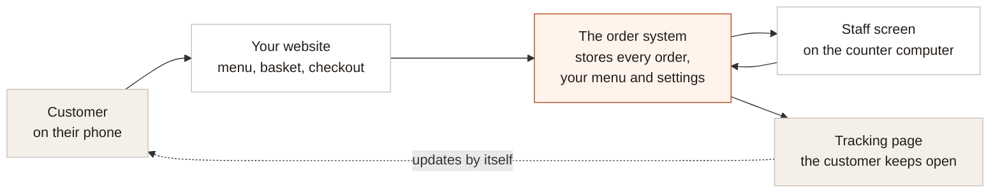

**The order system in the middle is the single source of truth.** If a time
slot is full, or an item has just sold out, the middle box refuses the order
even if the customer's phone still shows it as available. That matters: it
means two people cannot book the last 12pm slot at the same time.

---

## 4. What your customers see

### 4.1 The journey, start to finish

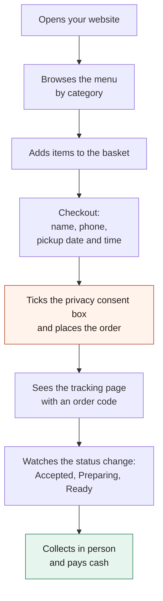

The basket survives if they close the browser and come back an hour later.
The tracking link also gets saved on their phone, so "I lost the link" is
usually solved by reopening your site.

### 4.2 The three customer screens

<table>
<tr>
<td align="center">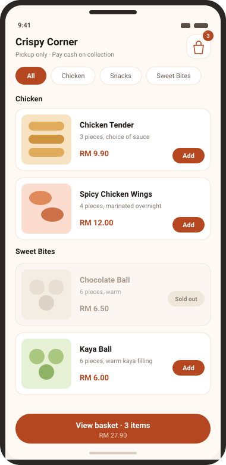 <b>1. The menu</b></td>
<td align="center">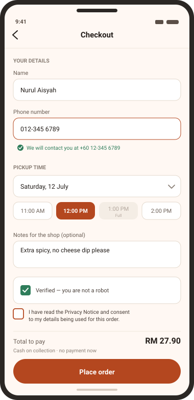 <b>2. Checkout</b></td>
<td align="center">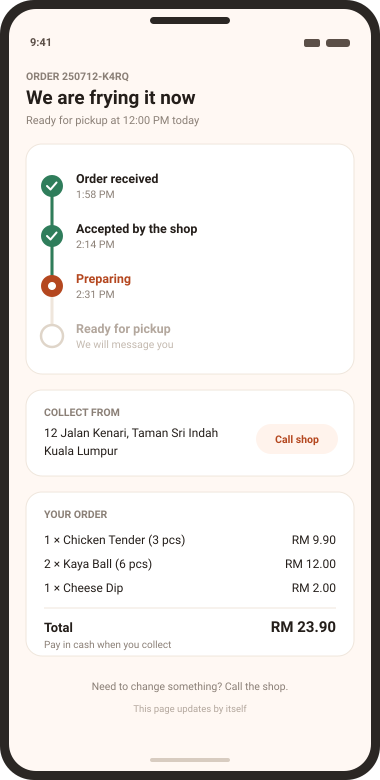 <b>3. Tracking</b></td>
</tr>
</table>

**1. The menu.** Items grouped the way you group them — Chicken, Snacks,
Sweet Bites. Each shows a photo, a short description and the price. Anything
you have marked sold out appears greyed out and cannot be added, so nobody
orders keropok lekor you ran out of at 9am. The basket total sits at the
bottom of the screen the whole time.

**2. Checkout.** Four things only: name, phone, pickup slot, and an optional
note. **No address field, no card details.**

Two details on this screen were chosen deliberately:

- *The phone number is read back to the customer.* They type `012-345 6789`
  and the screen confirms `+60 12-345 6789` underneath. With no customer
  accounts, a mistyped digit means you cannot reach them at all — this
  catches it at the moment it happens, and it is friendlier than making them
  type the number twice.
- *Full slots show as full, not as missing.* If 1pm is fully booked it stays
  visible and greyed. An empty dropdown makes customers think the site is
  broken and phone you.

The tick box and the "you are not a robot" check are both required before
the button works — one is a legal requirement (see [section 8](#8-privacy-and-malaysian-law-pdpa)),
the other keeps automated junk orders out.

**3. Tracking.** This is the page the customer sees straight after ordering,
and the page your staff send over WhatsApp. It shows each completed step
**with the actual time it happened** — "Accepted 2:14 PM, Preparing 2:31 PM"
— because a real timestamp tells a waiting customer far more than a
highlighted label. Underneath: pickup time, your address, the item list and
the total, stated plainly as payable in cash on collection.

Two moments get special treatment rather than being just another line:

- **Ready** takes over the whole screen, because that is the moment the
  customer needs to act.
- **Cancelled** always shows the reason your staff typed. A cancellation
  with no reason generates a phone call every single time.

Customers can cancel themselves only while the order is still New. Once you
have accepted it and the kitchen has started, the page shows your phone
number and asks them to call — by then the food is already in the fryer.

---

## 5. What your staff see

Behind a login, on the counter computer. What someone sees depends on who
they are: **counter staff** get the order queue, their own shift and their own
sales; **you, the owner,** get all of that plus the menu, prices, settings,
staff accounts and everybody's figures.

### 5.1 The order queue — the screen that stays open all day

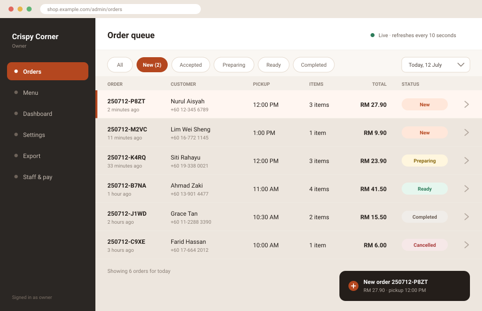

Every order for the day on one list, newest at the top. **The screen
refreshes itself every ten seconds** and plays a sound with a pop-up when a
new order arrives — nobody has to keep pressing refresh. Filter by status
(New, Preparing, Ready…) or by date. Click any row to open it.

### 5.2 One order in full

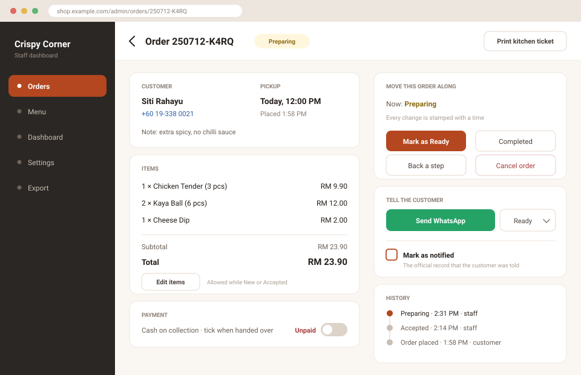

Everything about one order in one place, and the buttons to move it along.

Three things worth pointing out:

- **Payment is tracked separately from status.** An order can be *Ready* and
  still *Unpaid*; you tick "paid" at handover. Keeping these apart avoids a
  confusing "ready but not paid yet" status.
- **"Send WhatsApp" and "Mark as notified" are two different things,
  on purpose.** The WhatsApp button opens WhatsApp Web with a message
  already written for you. But the website cannot know whether you actually
  pressed send — so the *record* that a customer was told is the tick box,
  ticked by a human. If we merged them, your history would claim customers
  were notified when they were not.
- **Every change is stamped with a time and kept forever.** That list at the
  bottom right is your audit trail. It is also exactly what the customer
  sees on their tracking page, so the two can never disagree.

Cancelling asks for a reason, and that reason goes straight to the customer.

There is also a **Print kitchen ticket** button that produces a clean paper
summary on an ordinary desktop printer.

### 5.3 Your menu — you control it, no developer needed

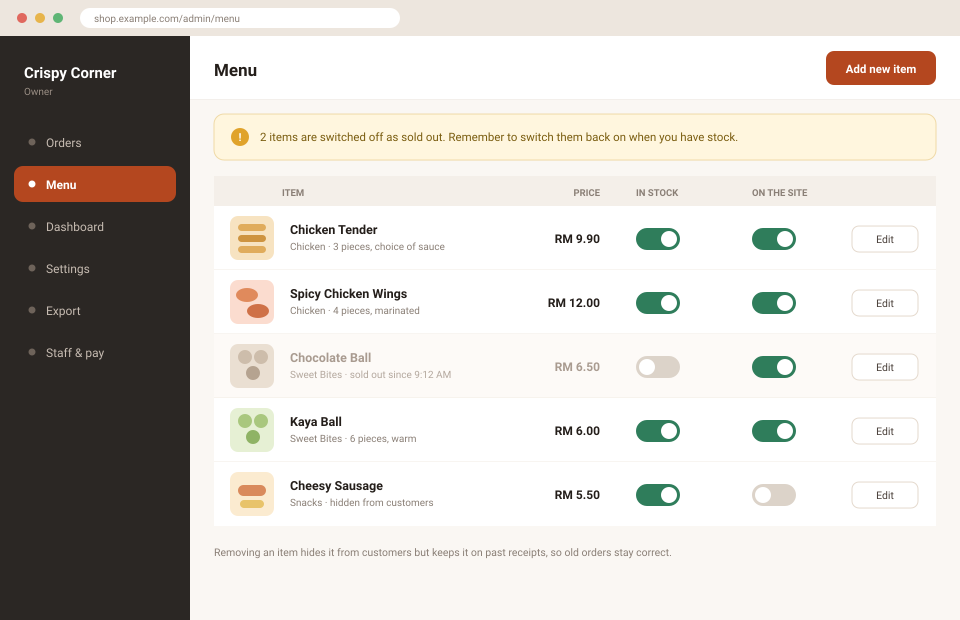

Add items, change prices, upload photos, reorder the list, and toggle two
separate switches per item:

- **In stock / Sold out** — the quick daily toggle.
- **On the site / Hidden** — for seasonal items you are not selling yet.

**Changing a price never changes a past receipt.** Every order permanently
stores the name and price as they were the moment it was placed. Likewise,
removing an item hides it from customers but keeps it intact in your order
history, so last month's records stay accurate.

### 5.4 Today at a glance

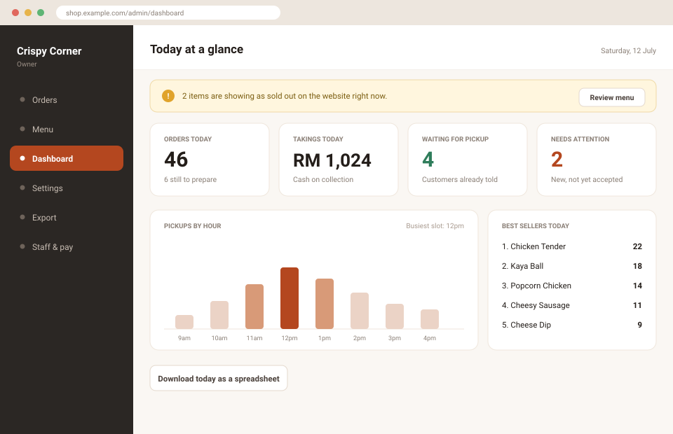

Order count, takings, what is waiting for pickup, what still needs
accepting, your busiest hours and your best sellers. One button downloads
the day as a spreadsheet for your accounts.

The yellow bar at the top counts items currently marked sold out. **It is
there because of a specific failure we expect.** Every night the system
automatically switches everything back to in-stock. One day that automatic
job will fail quietly, and without the bar you would spend a Saturday
turning customers away from food you actually had in the kitchen. The bar makes a
forgotten sold-out flag impossible to miss.

### 5.5 Everyone signs in as themselves

Because pay is based on sales, the system has to know who made each sale.
That only works if each person has their own login — so there is no shared
counter account, and staff pick their name from a list and enter a PIN rather
than typing a username.

Three details exist purely to stop the wrong person getting credit:

- **The name of whoever is signed in sits at the top of the screen at all
  times.** On a shared counter machine, the most likely thing to go wrong is
  one person's sales landing on the previous person's account. Making the
  name impossible to miss is the cheapest defence there is.
- **The screen locks itself** after a few idle minutes and asks for the PIN
  again. It does not sign the person out — losing an open shift in the middle
  of service would be worse than the lock.
- **Marking an order paid says whose figures it will count towards** before
  you press it. A silent toggle is not enough when the press decides
  somebody's pay.

### 5.6 Shifts, and who gets credit for a sale

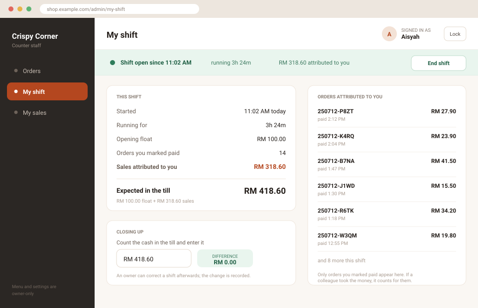

A staff member starts a shift when they come on, with the float that is in
the till. From then on, every order they mark as paid counts towards them.
At the end they see what should be in the till — float plus their sales — and
can enter what they actually counted.

**The rule is: a sale counts for whoever took the money.** Not whoever
accepted the order, not whoever cooked it. Cash changes hands exactly once,
that moment has exactly one owner, and it is the only version that matches
the money in the till at the end of the day.

> **Please confirm this rule before we build it.** It decides what your staff
> get paid, so it is your call and not ours. The alternatives are crediting
> whoever accepted the order, or splitting a sale between everyone who touched
> it. Both are possible; both are harder to check and harder to explain to
> staff. Tell us which you want.

Because credit follows the person rather than the clock, **two people can work
the same lunch rush without any confusion.** Each order belongs to exactly one
of them. Nothing is double counted and nothing falls between two shifts.

If a shift is left open overnight — and one eventually will be — the system
closes it automatically and marks it as auto-closed, rather than leaving a
shift that appears to run for three days and ruins every report it touches.

### 5.7 What each person sold

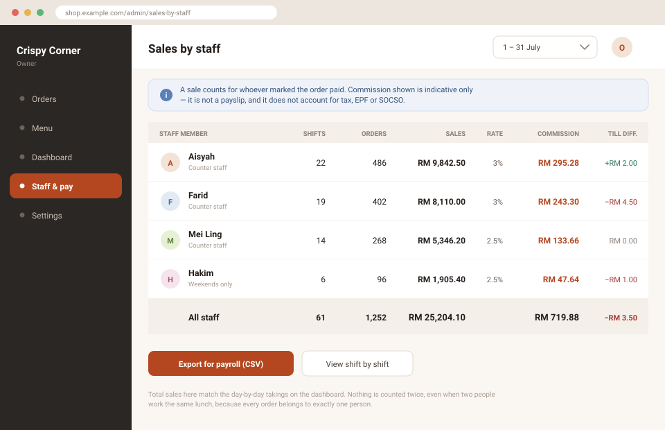

Your report, for any period you choose: shifts worked, orders taken, sales,
and — if you tell us each person's commission rate — an indicative commission
figure. One button exports it as a spreadsheet for whoever does your payroll.

Staff can see their own figures at any time, which heads off most end-of-month
arguments. **They cannot see each other's.**

Two things this screen is deliberately *not*:

- **It is not a payslip.** The system reports what people sold. It does not
  calculate wages, tax, EPF or SOCSO, and we are not going to make it try —
  that is payroll software, a different thing with different legal duties.
- **It is not the final word.** If someone was credited wrongly, you can move
  a sale to the right person. That correction is recorded — who changed it,
  when, and what it was before — so the figures stay trustworthy rather than
  merely editable.

---

## 6. The life of an order

Six states. Every arrow is a button someone presses, and every press is
recorded with a time.

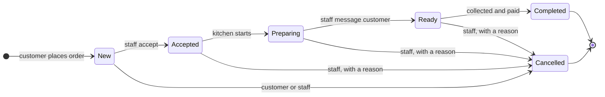

**Why "Accepted" exists as a separate step.** It is a deliberate human gate.
An order sits as *New* until a person looks at it and agrees to make it.
Nothing goes into the kitchen automatically. That single step is your main
protection against a prank order costing you a full tray of food.

---

## 7. How the system protects you

Cash on collection with no address is genuinely exposed: if someone does not
turn up, you have already cooked the food and you have only a phone number. Four
defences work together.

| Defence | What it does |
| --- | --- |
| **"Not a robot" check at checkout** | Blocks automated junk orders outright |
| **Three open orders per phone number per day** | One person cannot flood you with fake orders |
| **Limited orders per time slot** | Caps how much you can lose in any one hour, and keeps the kitchen sane |
| **The "Accepted" step** | A person approves every order before any cooking starts |

If no-shows ever become a real problem, the honest answer is a deposit —
which means adding online payment. Nothing in this design blocks that later;
it is simply not worth the cost and complexity on day one.

### Protecting the pay figures

Paying commission on a number means the number has to be worth trusting. Five
rules do that work:

| Rule | Why it is there |
| --- | --- |
| **Only you can change prices** | Otherwise a staff member could raise a price, sell it, and lift their own commission |
| **Nobody can edit their own shift** | Shift times and floats are yours to correct, not theirs |
| **Nobody can move a sale to themselves** | Only you can reassign credit, and the change is recorded |
| **Cancelling an already-paid order needs you** | Otherwise someone could mark orders paid, take the credit, and cancel them later |
| **Every change keeps its history** | Corrections add a line; they never quietly overwrite the old figure |

None of this assumes your staff are dishonest. It assumes that when money
depends on a number, the number needs to be checkable — which protects honest
staff just as much as it protects you. If someone queries their pay, you can
show them exactly which orders made up the total.

**Other quiet protections built in:**

- Double-tapping "Place order" creates **one** order, not two.
- Order codes look like `250712-K4RQ` — the random ending means nobody can
  guess another customer's order or work out how many orders you take a day.
- The tracking link contains a long random code, so there is nothing to
  guess and nothing to type. The "lost my link" lookup form is deliberately
  slowed down to stop anyone fishing through it.
- Your order data is backed up every night, and we will test restoring it
  once before you go live. An untested backup is not a backup.
- Testing happens on a completely separate copy of the system, so we can
  never touch a real customer order while working.

---

## 8. Privacy and Malaysian law (PDPA)

You collect names and phone numbers, so the shop falls under Malaysia's
**Personal Data Protection Act 2010**, as amended in 2024 and now fully in
force. Here is where you stand, in plain terms.

**The good news — some obligations do not apply to you.** You do not need a
formal Data Protection Officer. That requirement starts at 20,000 customers
on file; a single shop is nowhere near it.

**What does apply, regardless of your size:**

| Obligation | What it means for you in practice |
| --- | --- |
| **Consent** | The unticked box at checkout, plus a privacy notice page. We record the exact moment each customer agreed. Consent you cannot prove does not count. |
| **A notice in two languages** | The Act requires Bahasa Malaysia *and* English. English alone is a compliance gap. Both are planned. |
| **Breach notification** | If customer data is ever exposed, the regulator must be told within **72 hours** and affected customers within **7 days**. |
| **Data stored overseas** | Our hosting sits outside Malaysia. That is allowed, but must be disclosed in your notice — and we will choose the regions deliberately rather than accepting defaults. |
| **Deleting old data** | Orders are kept for accounting and then deleted; cancelled orders sooner. You need to confirm both periods. |
| **Your staff's data counts too** | Names, logins and the sales figures behind someone's pay are personal data about your employees, under the same law. Staff should be told what is recorded about them, and no one can see a colleague's figures. |

**One consequence worth knowing about.** Malaysian employment law requires you
to keep wage records, and the orders behind a commission payment are part of
the evidence for those wages. So the system must not delete an order that
still backs somebody's pay, even if the accounting rule would otherwise allow
it. When you confirm your retention periods with your accountant, ask about
both — we will apply whichever is longer.

**Two things we need you to arrange before your first real order:**

1. **A Malaysian lawyer reads the privacy notice.** We have written a solid
   draft, but it is a working draft written by developers, not legal advice.
2. **A one-page "what if there is a breach" procedure.** Who gets called
   first, who decides how serious it is, who files the report, how customers
   are told. This cannot be invented inside a 72-hour deadline — it has to
   exist beforehand. We will draft it; you approve it.

---

## 9. What we left out on purpose — and what it would take to add

Nothing below is blocked by a bad decision made now. The system was built
leaving room for each one.

| If you later want… | What is involved |
| --- | --- |
| **Delivery** | The order records already have unused, hidden spaces for an address and a delivery fee. Adding delivery means new screens and new rules, but no risky surgery on your live order history. |
| **Online payment or deposits** | A new piece of work, and the point where it plugs in already exists. It would also mean revisiting who gets credit for a sale, since the money would no longer change hands at the counter. |
| **Emailing customers automatically** | The exact spot in the code where an email would be sent is already marked and waiting. |
| **A second outlet** | The largest of these. This one would be real work. |

*Per-staff logins used to be on this list. They are now part of the build —
see [section 5.5](#55-everyone-signs-in-as-themselves).*

---

## 10. How we build it — the plan

Work happens in five stages. **Each stage ends with something you can see
and try yourself**, not a status report. The two halves of the system (the
customer website and the engine behind it) are built in step with each
other, with the engine running one stage ahead.

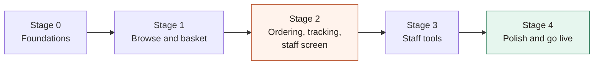

| Stage | What gets built | You will be able to… |
| --- | --- | --- |
| **0 — Foundations** | The skeleton of both halves, the database, hosting, error alerts | See a working (empty) site at a real web address |
| **1 — Browse and basket** | Menu display, item pages, the basket | Browse your real menu and fill a basket on your own phone |
| **2 — Ordering, tracking, staff screen** ⭐ | Checkout, order tracking, per-person staff logins, shifts, the order queue, status buttons | **Place a real order, watch it appear on the counter screen, and see the sale land on the right person** |
| **3 — Staff tools** | Menu editing, photo upload, WhatsApp messages, settings, dashboard, staff accounts and the sales-by-staff report | Add a brand-new snack with a photo and order it — and run a full day of two overlapping shifts that add up correctly |
| **4 — Polish and go live** | Printable tickets, spreadsheet export, Bahasa Malaysia notice | Run a full day without ringing us |

**Stage 2 is the big one** and will take noticeably longer than the others.
It contains the checkout, the tracking page, the staff order screen and the
login-and-shift system — over half the whole project. Expect the pace to look
slower there; that is normal, not a problem.

Per-staff logins and the pay reporting are a real addition to the original
plan. They add work to Stages 2 and 3 rather than sitting on the end, because
the "who did this" record has to be right from the first order — it cannot be
reconstructed afterwards.

---

## 11. What we need from you

Work can start today, but these unblock later stages. The first one is
urgent.

### ⚠️ Needed before Stage 2 — a web address you own

We need one domain name, used for both halves, for example
`shop.yourshop.com` for the website and `api.yourshop.com` for the engine.

**This is not cosmetic.** Without it, the staff login breaks in a specific
and nasty way: it works perfectly on our computers and on some of yours,
then silently fails on an iPhone at the counter. Safari already blocks the
mechanism involved and Chrome is phasing it out. Working around it means
building the login a completely different way — more code, weaker security,
and it must be decided *before* we build it, not after.

A domain costs a few tens of ringgit a year. Please buy one early.

### Before Stage 1 — your menu

- Your categories, in the order you want them shown
- Every item: name, one-line description, price
- A photograph of each item (phone photos are fine, well-lit and square)
- Any options per item: regular or large, original or spicy, add-ons like an
  extra sauce or a cheese dip

### Before Stage 2 — how your shop runs

- Opening hours, and any days you are closed
- How long each pickup slot is, and how many orders you can handle per slot
- Minimum notice — how far ahead must someone order? (This stops an order
  landing five minutes before pickup with nothing in the fryer yet.)
- Daily cutoff time for next-day orders
- Shop address and phone number as you want them shown to customers

### Before Stage 2 — your staff and how they are paid

- **The list of people** who will use the system, and which of them are
  counter staff rather than owner. Each gets their own login — please do not
  plan to share one, as it would make every sales figure meaningless.
- **Confirm the credit rule.** Our recommendation is that a sale counts for
  whoever marked it paid, i.e. whoever took the money. Say if you want it
  done differently. This one decides what people are paid, so we need it in
  writing before we build it.
- **The opening float** you normally put in the till at the start of a shift.
- **Each person's commission rate**, if you want the report to show an
  indicative commission figure. If you would rather it just showed sales and
  you do the arithmetic yourself, that is fine too — tell us.
- **How long a shift can run** before the system should close a forgotten one
  automatically. Twelve hours is a sensible default.

### Before Stage 3 — your words

- The WhatsApp message you want sent when an order is **accepted**,
  when it is **ready**, and when it is **cancelled**. We will fill in the
  customer name, order code, total and pickup time automatically — just
  write the wording you would normally type.

### Before going live — the legal bits

- Your registered shop name, and a contact email and phone for privacy
  questions
- How many years you keep order records — **please confirm with your
  accountant**; seven years is the usual Malaysian answer
- A Malaysian lawyer's review of the privacy notice
- Sign-off on the one-page breach procedure
- Tell your staff what the system records about them and why — their name,
  their login and the sales behind their pay are all their personal data, and
  they are entitled to know
- Confirm with your accountant how long wage records must be kept, alongside
  the order retention period

---

## 12. A few words explained

| Word you will hear | What it actually means |
| --- | --- |
| **Frontend** | The part customers and staff look at and click |
| **Backend** | The engine behind it: stores the orders, enforces the rules |
| **Slot** | A pickup time window customers choose at checkout |
| **Soft delete** | Removing an item from the menu while keeping it in past orders, so old receipts stay correct |
| **Order code** | The short code like `250712-K4RQ` you read out over the phone |
| **Shift** | The stretch between a staff member starting and ending their session, used to group their sales and reconcile the till |
| **Attribution** | Which staff member a sale counts towards — here, whoever marked the order paid |
| **Float** | The cash already in the till at the start of a shift, before any sales |
| **Staging** | A private duplicate of the whole system for testing, so real orders are never touched |
| **PDPA** | Malaysia's Personal Data Protection Act 2010 |

---

## Questions?

Anything in here that sounds wrong, or does not match how your shop actually
runs, is worth flagging now. Changing a rule at this stage is a
conversation. Changing it after Stage 2 is rebuilding.
